## [男女关系图鉴](https://x.com/ZhanlinYan74392/status/2096980792387977424)

Yan(赚钱版) · 2026-09-07

本文的写作目的，是科普全部18种男女关系，并且给出具体场景帮助你理解，建议把本文作为整个系列的基础信息食用。
**你可以基于此定位自己现在正处在什么关系里，以及判断你想发展什么关系，或者对方。**
文中内容不保证完全正确。有相当一部分是我根据自己的经验以及相关科学研究整理。
**正文开始以前，依然先澄清两件事。**
> 第一，本文涉及的所有性行为，都必须建立在成年男女双方自愿的前提下。任何违法、胁迫或者存在金钱交易的性行为，都不在本文讨论范围内，并且是我严厉反对的。
> 第二，文中配图可能来自网络，不一定是作者本人的实际经历。如有雷同，纯属巧合。
## 首先你需要看这张关系图我知道比较难懂所以直接开始解释。
按照关系的起点，你和任何人的关系都来自两个地方。
**第一，陌生人。第二，朋友。**
然后你和任何人的关系最后都会发展成两种：
**第一，有承诺。第二，没有承诺。**
你们原本是陌生人，可能会先暧昧、约会，也可能第一次见面就发生关系；你们原本是朋友，也可能继续发展成 FWB，或者正式恋爱。
基于这些可能性，一共衍生出了下面 **18 种关系**。
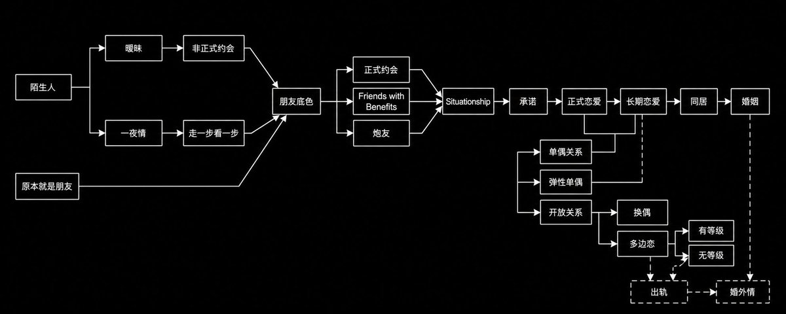
所有男女关系图
## 一、没有正式承诺的关系
## **1\. 暧昧**
第一种关系就是暧昧。
什么叫暧昧呢？
暧昧常见于学生阶段的恋情。这个时候大家比较单纯，或者你对于恋爱还是有一些幻想。
暧昧最常见的场景是，两个人不会单独出去，但是会故意借着见别人的机会，去见那个自己真正想见的人。
举个例子，你参加一个社团活动其实只是想见社团里的某个女生然后跟她聊天。或者一群朋友在排队的时候，你故意走过去跟某个人聊几句然后回去发消息。但是你们两个人比较少单独出去。
这个就是暧昧。
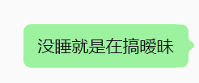
## 2. 非正式约会
暧昧的下一个阶段，就是非正式约会，Casual Dating。
什么叫非正式约会呢？
就是你们两个已经会单独出去，但是你们出去的名义可能只是吃饭、喝酒。你们并没有明确说：“我们今天就是出来 Date。”
还有一种情况，就是你们两个都知道算约会，但是谁都没有说约会关系是一对一的。
这个就叫非正式约会。

**你要注意，这个东西跟你心里怎么想没有任何关系。**

就算你心里觉得自己只想见她，但是你们两个人没有达成一致，那客观上你们就没有一对一。

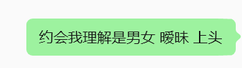

## 3. 正式约会

非正式约会和正式约会的区别，是你们两个出去的目的到底是不是约会。

如果你约好了和这个学姐出去 Date，她也知道你们这次就是约会，那你们就已经进入了正式约会。

如果你觉得这是正式约会，她觉得你们只是出去吃个饭，那不算。

然后正式约会继续一段时间，你们可能会开始一对一，也就是排他约会。

这里还要注意，正式约会不等于正式恋爱。

你们只是在认真地互相了解，并且判断要不要进入一段正式关系。

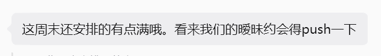

## 4. Friends with Benefits

到了这里，知名词汇FWB终于出现了。

如果你们原本就是朋友，你们可能会发展成 Friends with Benefits，也就是 FWB。

什么叫 Friends with Benefits？

**就是你们主要是朋友，偶尔睡觉。**

你们本来就有友情关系，也可能有一些利益关系或者合作关系。你们平时会互相帮助，也会出去玩。如果两个人都 OK，出去玩的时候也可以睡。

但是睡觉在这段关系里面占得比较少，朋友才是主体。

如果你们原本不认识，但是已经经过了非正式约会或者正式约会，那你们其实也已经有朋友的底色了，不再算完全不认识。

所以这个时候，你们同样有可能发展成 Friends with Benefits。

**Friends with Benefits 是主要做朋友，偶尔睡觉；炮友是主要睡觉，其次是朋友。**

你要知道这段关系的主体是什么。

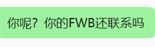

## 5. 一夜情

那么这个时候你会发现，还有一种关系没有提到：我们第一次见面就睡觉了这个叫什么？

这个叫一夜情，One-night Stand。

一夜情就是你们第一次见面发生了一次性关系。发生完以后，没有人说下一次，也没有人定义你们以后是什么关系。

如果只发生这一次，那它就是一夜情。

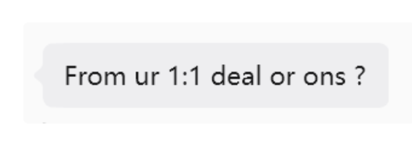

## 6. 走一步看一步

如果一夜情发生了第二次、第三次，这个时候还不一定叫炮友。

因为没有人定义这个事情，所以我会把这个阶段叫作走一步看一步。

走一步看一步的意思就是，两个人现在没有任何明确的关系约束也不确定后面会发展成什么。

可能继续发生关系，可能变成朋友，可能开始谈恋爱，也可能突然就不联系了。

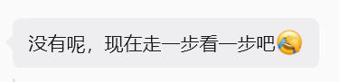

## 7. 炮友

走一步看一步以后，有可能会发展成炮友。

炮友的定义就是：

**你们的相处主要是发生性关系，做朋友是第二位的。**

炮友可以临时联系，也可以固定每周约一次。

所以没有什么临时炮友和固定炮友的区别，只要你们两个人相处的主体是性，我就统一把它叫作炮友。

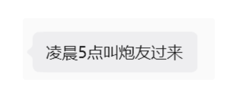

## 8. Situationship

OK，到目前为止，我们前面讲的这些关系都没有建立正式的恋爱承诺。

**那么没有承诺的关系，最后会走到哪里呢？**

就是终于聊到了 Situationship。

什么叫 Situationship？

**就是情侣的相处模式已经变成了主体，但是你们两个人不承认自己是情侣。**

你们做的所有事情都和情侣一样。但是你们没有承认关系，也没有承担情侣关系的承诺。

所以 Situationship 和情侣的唯一区别，就是承不承认关系。

那你可能会问，为什么我都已经做了所有情侣会做的事情，还是不想承认关系？

因为承认关系本身就是一个心理负担。

有的人愿意享受情侣的相处，但是暂时不想承担男朋友或者女朋友的责任，所以这段关系就会停在 Situationship。

Situationship 可能持续几个月，也可能只持续几分钟。

比如说你的炮友变成了你的女朋友，你可能会觉得，我们两个根本没有经历过 Situationship 啊？

经历过。只是这个阶段非常短。

只要你的脑子里，是从一段没有承诺的关系走到一段有承诺的关系，你一定会经历 Situationship。可能是几个月，也可能只是你开口说“那我们就在一起吧”以前的几分钟。

你一定要注意到自己有这个阶段。因为你只有注意到了，才知道自己现在到底想干什么。

不要稀里糊涂地进入一段关系，好吧？

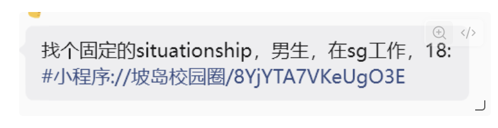

## 二、有正式承诺的关系

## 9. 正式恋爱

当你们承认了 Situationship，并且答应了彼此一个正式的恋爱承诺，你们就变成了情侣。

这个就是正式恋爱。

刚开始谈恋爱的时候，关系可能还不稳定。你们虽然确认了男女朋友的身份，但是仍然在继续了解彼此。Pasted image 20260907225919.png

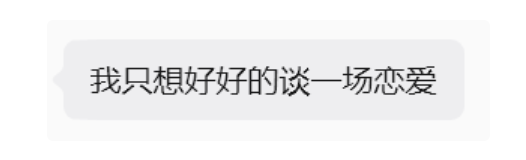

## 10. 长期恋爱

正式恋爱过了一段时间，关系稳定了，就会变成长期恋爱。

这个时候你们可能还没有住在一起。

你们可以在同一个城市，也可以是异地恋。异地和同城只是两个人怎么见面的区别，它还是长期恋爱。

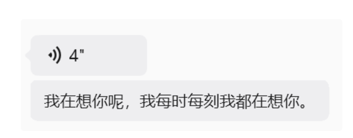

## 11. 同居

长期恋爱久了，很多人就会开始同居。

同居就是你们已经生活在一起，但是还没有结婚。

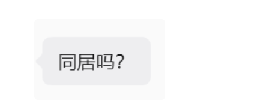

## 12. 婚姻

同居久了，有一些人会结婚，这个就是婚姻。

结婚和谈恋爱不一样。婚姻里面考虑的利益关系会更多一些，包括财产、家庭和长期责任。

但是我认为大部分看我账号的同学，暂时还不会考虑到结婚。所以婚姻这部分我们先不聊。

## 三、对方知道的开放关系

接下来我们聊关系里出现第三个人的情况。

这里首先分成两种：

**第一，对方知道。第二，对方不知道。**

对方知道并且同意，这个叫开放关系。

开放关系本来就是存在于承诺关系里面的。因为它依然是一个 Relationship，你和你的主要伴侣之间依然有承诺，只不过你们对于性和感情的开放程度不一样。

## 13. 弹性单偶

如果你们主要还是一对一，但是偶尔允许对方和别人发生性关系，这个叫弹性单偶，Monogamish。

## 14. 开放关系

如果你们不太在意偶尔还是经常，允许对方比较稳定地和别人发生性关系，但是主要的感情承诺依然留在你们两个人之间，这个就是开放关系，Open Relationship。

所以开放关系还要继续问：你们只是允许对方跟别人睡，还是允许对方跟别人谈恋爱？

如果只是跟别人睡，还要再问，是偶尔发生，还是经常发生。

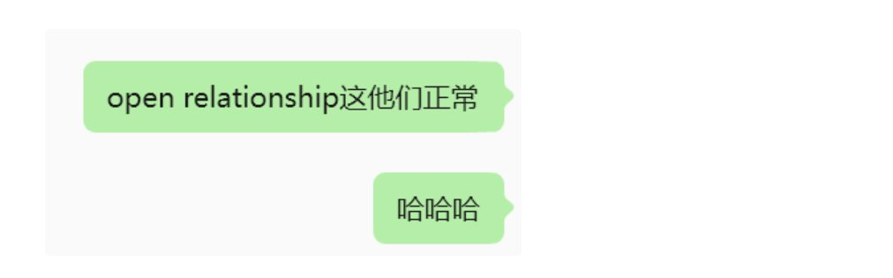

## 15. 换偶关系

如果是双方共同参与，这个叫 Swinging，也就是换偶关系。

这个不建议不支持不讲。

## 16. 多边恋

如果你允许对方不只是跟别人睡，还可以和别人谈恋爱，这个叫多边恋。

多边恋还要分有没有等级。

如果你有一个主要伴侣，其他人是次要伴侣，这个叫有等级。

如果每一段关系都单独相处，你也不知道自己在对方那里排第几，这个叫没有等级。

太复杂不展开。

## 四、对方不知道的关系

如果对方不知道，也没有同意，这个就不叫开放关系。

## 17. 出轨

如果只是偶尔和第三个人发生性关系，有可能是酒后乱性，也有可能是微醺乱性，或者就是突然想找刺激，这个叫出轨。

所以按照本文的分类，出轨是偶尔发生的关系越界。

## 18. 长期劈腿和婚外情

如果在原来的伴侣之外，还有一个或者多个固定的关系，这个就不是偶尔出轨了。

没有结婚的时候，可以叫长期劈腿；已经结婚以后，就叫婚外情。

为什么会出现婚外情呢？

有可能是自己的老公或者老婆没有办法满足性生活，有可能是情绪和亲密关系没有办法被满足，也有可能就是单纯想找刺激。

但是这种人又不想到处乱找，所以他找到了一个固定的人，这个就是婚外情。

**开放关系和出轨的区别，就是对方知不知道、同不同意。**

对方知道并且同意，是开放关系。对方不知道，就是出轨或者婚外情。

## 最后

OK，到这里，所有关系就基本讲完了。

你会发现，这个分类法可以把所有关系都放进去，并且可以让你非常清晰地知道，自己和现在的亲密关系对象到底是什么关系。

**那为什么一定要知道自己是什么关系呢？因为这个关系会决定你脑子里对于这件事情的幻想。**

你脑子里的幻想，会决定当你们之间发生不好的事情时你的情绪控制。

比如说，你觉得你们在正式约会，她觉得你们只是出去吃饭；你觉得你们已经是情侣，她觉得你们只是 Situationship；你觉得你们是 FWB，她觉得你们就是炮友。

那你们两个人后面一定会出现问题。

所以你需要知道三件事：

**第一，你们现在是什么关系。第二，你下一阶段想把它发展成什么关系。第三，她下一阶段想把它发展成什么关系。**

这三个事情对齐了，你就知道下一步应该怎么做了。

本文作为基础信息食用。

到这里就结束了。

**本指南纯属虚构，如果有效，是你天赋异禀，与我无关。如有一个疑问，欢迎私信。如果有大量疑问，需要付费咨询。**

Want to publish your own Article?

[Upgrade to Premium](/i/premium_sign_up)

**精选留言**

- 
  Yan(赚钱版)
  (作者)
  赞0
  谢谢zen老师

- 
  威廉不是王子
  赞0
  课代表签到

- 
  Yan(赚钱版)
  (作者)
  赞1
  给满分

- 
  Foe Ally
  赞2
  我觉得这一篇可以做成类似 MBTI 的测试题：给你做100多道测试题，最后推理出你们两个居然是什么关系。

- 
  govin.eth | G哥
  赞0
  这东西允许吗 哈哈哈

- 
  六水六水
  赞3
  别的不说，我要和严哥搞situationship（我开玩笑的

- 
  XIBA
  赞0
  这起号速度太牛逼了

- 
  Tom Zheng
  赞0
  做成测试或者小程序吧

- 
  懒家伙
  赞0
  关系叫什么其实没那么重要，真正重要的是双方对边界、承诺和下一步的共识

- 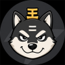
  王二狗
  赞0
  关系图那个思路挺好，从陌生人和朋友两条线拆开，一下子就清晰了。

- 
  魔王w3
  赞0
  牛逼啊，天天又爆了，看样这个话题经久不衰

- 
  琪琪同学
  赞0
  这在哪里看的？

- 
  Zh1x1an Q
  赞0
  要文艺复兴了有感觉吗？回到在17世纪初叶，⼈们对性还有⼏分坦诚。

- 
  爱溪
  赞1
  但是…我翻遍了，也没找到我和某人的关系啊…

- 
  藤原拓海
  赞0
  Yan哥 你看起来像要写葵花宝典

- 
  王大可Alien
  赞0
  我猜yan哥的yan是卡颜的颜🫪

- 
  xczm
  赞0
  牛学到了。写这么多字不容易，点赞！

- 
  要一直一直在
  赞0
  人和人对彼此的关系定义大多数时候是不对等的。如果对等，那相处起来肯定很舒服。

- 
  Elsinore
  赞0
  《霍乱时期的爱情》写了几百段各种恋爱关系都没你概括的全

- 
  ivan zheng
  赞0
  差点看错了，这太容易误解了

- 
  Zen古柯默
  赞0
  来啦

- 
  西湖小笼包
  赞0
  严肃品鉴

- 
  你和别人真不一样
  赞0
  俺也没找到。

- 
  交易强势股
  赞0
  真的吗

- 
  AAT
  赞0
  強
